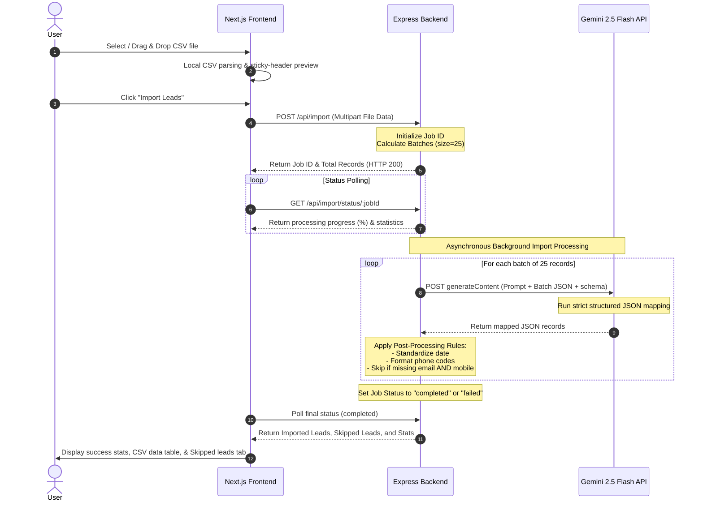

# ⚡ AI-Powered CRM Lead CSV Importer

[](#)
[](#)
[](#)

A full-stack, enterprise-grade CSV importer that intelligently parses, maps, and cleans CRM lead contact data from **any arbitrary CSV layout** (e.g. Google Ads, Facebook Leads, custom spreadsheets) into a unified, normalized **GrowEasy CRM schema**.

Powered by **Gemini 2.5 Flash** with native JSON schema constraints, the application performs fuzzy field matching, batch data sanitization, background job execution, and client-side high-performance tabular previews.

---

## 🏗️ Architecture & Data Flow

Below is the design of the mapping pipeline showing how data moves from user upload to standardized output:



---

## 🌟 Key Engineering Features

- **Fuzzy AI Column Mapping**: No more mapping headers manually. Whether a CSV has "Mail", "Email Address", "Contact E-mail", or "Mail Address", Gemini's semantic model automatically maps them to the standardized CRM fields.
- **Structured JSON Schema Constraints**: Uses Gemini's native `responseSchema` validation configuration to guarantee that the output JSON strictly matches our required database schema and enum definitions, reducing malformed JSON parses.
- **Client-Side Responsive Previews**: Parses the CSV locally on file drop and displays a sticky-header, fully-scrollable interactive table layout to confirm fields before pushing data to the server.
- **Asynchronous Background Processing**: The backend handles CSV uploads through an Express queue state machine. Upon uploading, the client receives a unique job ID immediately and polls for real-time progress updates, keeping the UI responsive even for heavy uploads.
- **Robust Batching with Backoff Retries**: Processes rows in optimized batches of 25 to optimize rate limits. Employs exponential backoff retry algorithms to handle rate limiting (`429`) or temporary API timeouts (`503`).
- **Post-Processing Business Logic**:
  - **Auto-Skip Validation**: Drops invalid rows that lack both an email and a phone number, preserving them in a downloadable "Skipped Records" list with the original formatting and the exclusion reason.
  - **Data Consolidation**: Merges multi-email or multi-phone arrays. Maps primary contacts to their fields and routes all secondary emails/phones or raw unmapped columns into a concatenated `crm_note` field.
  - **Status Normalization**: Maps raw input status values (e.g., "warm lead", "won", "no answer") cleanly onto standard CRM enums.
- **Adaptive Light/Dark Theme**: Styled using modern vanilla CSS custom properties (variables) with a premium glassmorphic UI.

---

## 🛠️ Technology Stack

| Layer | Technology | Primary Purpose |
| :--- | :--- | :--- |
| **Frontend** | Next.js (App Router, TypeScript) | Client UI, local CSV parsing, polling state machine |
| **Styling** | Vanilla CSS (CSS Variables) | Premium glassmorphism layout, fully responsive theme |
| **Backend** | Node.js (Express, TypeScript) | REST endpoints, upload handling, asynchronous jobs |
| **Parsing** | `csv-parse/sync` | High-accuracy backend CSV stream parser |
| **AI Mapping** | Gemini 2.5 Flash API | Semantic mapping and normalization |
| **Containerization**| Docker & Docker Compose | Containerization and single-command local stacks |

---

## 📁 Repository Directory Structure

```
assignment/
├── backend/
│   ├── src/
│   │   ├── services/
│   │   │   └── gemini.ts      # Gemini API prompt, schemas, batch processing, backoff
│   │   ├── index.ts           # Express server endpoints, job stores, upload pipelines
│   │   ├── listModels.ts      # Helper script to list available Gemini model details
│   │   └── test.ts            # Command-line validator script for testing CSV files
│   ├── package.json           # Node backend configuration & dependencies
│   ├── tsconfig.json          # TypeScript project rules
│   └── Dockerfile             # Multi-stage production node environment
├── frontend/
│   ├── src/
│   │   ├── app/
│   │   │   ├── page.tsx       # State machine, dropzone, table renders, progress tracker
│   │   │   ├── layout.tsx     # Application HTML shell
│   │   │   └── globals.css    # Responsive CSS variables, glassmorphism tokens
│   │   └── components/
│   │       ├── DragDropUpload.tsx  # Dynamic file drop UI handler
│   │       └── CsvTable.tsx   # Premium sticky-header CSV view
│   ├── package.json           # Next.js workspace configurations
│   └── Dockerfile             # Multi-stage Next.js builder
├── sample_inputs/
│   ├── facebook_leads.csv     # Sample export format from Facebook Ads
│   ├── google_ads.csv         # Sample export format from Google Ads
│   ├── messy_leads.csv        # Multi-email and unorganized custom CSV sample
│   └── invalid_leads.csv      # Sample with invalid rows missing required contact points
├── docker-compose.yml         # Dev environment deployment orchestrator
└── README.md                  # Comprehensive developer documentation
```

---

## 📋 GrowEasy CRM Data Schema

Every CSV record uploaded is mapped to the following schema structure:

| Field Key | Type | Description / Formatting Rules |
| :--- | :--- | :--- |
| `created_at` | `string` | Lead creation timestamp. Standardized to `YYYY-MM-DD HH:mm:ss`. |
| `name` | `string` | Lead's full name. |
| `email` | `string` | Primary email address. Extra email addresses are routed to `crm_note`. |
| `country_code` | `string` | Cleaned phone country dial code (e.g. `+91`, `+1`). |
| `mobile_without_country_code` | `string` | Mobile number stripped of the country dial code. |
| `company` | `string` | Name of the lead's organization. |
| `city` | `string` | City location. |
| `state` | `string` | State/Province location. |
| `country` | `string` | Country location. |
| `lead_owner` | `string` | Email address of the sales rep / CRM owner. |
| `crm_status` | `enum` | **GOOD_LEAD_FOLLOW_UP** (interested, warm, call back)<br>**DID_NOT_CONNECT** (busy, ringing, left message)<br>**BAD_LEAD** (spam, not interested, invalid)<br>**SALE_DONE** (closed won, deal closed, converted). |
| `crm_note` | `string` | Free text area containing original remarks, custom fields, extra emails, or alternative phone numbers. |
| `data_source` | `enum` | Tags the source channel: `leads_on_demand`, `meridian_tower`, `eden_park`, `varah_swamy`, `sarjapur_plots`. |
| `possession_time` | `string` | Target property possession timeframe. |
| `description` | `string` | Details, custom query remarks, or general text block. |

---

## ⚡ Setup & Run

### 🔑 Prerequisites

You need a **Gemini API Key** from Google AI Studio. 

---

### Option A: Local Development Setup (Recommended)

#### 1. Configure and Run Backend
1. Navigate to the backend directory:
   ```bash
   cd backend
   ```
2. Install all node packages:
   ```bash
   npm install
   ```
3. Create a `.env` file in the `backend/` directory:
   ```env
   PORT=5000
   GEMINI_API_KEY=your_actual_gemini_api_key
   ```
4. Start the backend developer server:
   ```bash
   npm run dev
   ```
   *The API will start listening at `http://localhost:5000`.*

#### 2. Run Terminal CLI Tests (Optional)
To verify CSV parsing and API key validation without spinning up the browser, you can run the test script:
```bash
# While in the backend/ folder
npm run test
```
This maps the files in `sample_inputs` and prints the structured JSON arrays straight to the terminal.

#### 3. Configure and Run Frontend
1. Open a new terminal session and navigate to the frontend directory:
   ```bash
   cd frontend
   ```
2. Install next.js packages:
   ```bash
   npm install
   ```
3. Start the Next.js local server:
   ```bash
   npm run dev
   ```
   *The user interface will be accessible at `http://localhost:3000`.*

---

### Option B: Docker Compose Container Setup

To boot the backend server, frontend client, and environment pipelines using containerization:

1. Ensure your Docker Daemon is active.
2. In the root project directory (`assignment/`), export your Gemini API Key as an environment variable or add it to a root `.env` file:
   - **Linux/macOS**:
     ```bash
     export GEMINI_API_KEY="your_actual_api_key_here"
     ```
   - **Windows PowerShell**:
     ```powershell
     $env:GEMINI_API_KEY="your_actual_api_key_here"
     ```
3. Launch the container cluster:
   ```bash
   docker-compose up --build
   ```
4. Open your browser and head to:
   - **Frontend App**: `http://localhost:3000`
   - **API Backend**: `http://localhost:5000`

---

## 📡 REST API Documentation

### 1. Upload & Import CSV File
*Initiates an import job. Raw records are parsed and mapped asynchronously.*

- **Endpoint**: `/api/import`
- **Method**: `POST`
- **Content-Type**: `multipart/form-data`
- **Body**:
  - `file`: `CSV File` (10MB limit)

**Response (HTTP 200 OK)**:
```json
{
  "success": true,
  "jobId": "c86db254-8c8e-49b2-a42e-834c387bbf86",
  "totalRecords": 45
}
```

### 2. Poll Import Job Status
*Returns progress metrics, processing state, mapped data arrays, and skipped row reasons.*

- **Endpoint**: `/api/import/status/:jobId`
- **Method**: `GET`

**Response - Processing (HTTP 200 OK)**:
```json
{
  "id": "c86db254-8c8e-49b2-a42e-834c387bbf86",
  "status": "processing",
  "progress": 60,
  "currentBatch": 3,
  "totalBatches": 5
}
```

**Response - Completed (HTTP 200 OK)**:
```json
{
  "id": "c86db254-8c8e-49b2-a42e-834c387bbf86",
  "status": "completed",
  "progress": 100,
  "currentBatch": 5,
  "totalBatches": 5,
  "result": {
    "stats": {
      "total": 5,
      "imported": 4,
      "skipped": 1
    },
    "importedRecords": [
      {
        "created_at": "2026-07-01 14:00:00",
        "name": "Elon Musk",
        "email": "elon@spacex.com",
        "country_code": "+1",
        "mobile_without_country_code": "3103636000",
        "company": "SpaceX",
        "city": "Los Angeles",
        "state": "California",
        "country": "USA",
        "lead_owner": "owner@groweasy.ai",
        "crm_status": "SALE_DONE",
        "crm_note": "Ad Campaign: meridian_tower",
        "data_source": "meridian_tower",
        "possession_time": "Immediate",
        "description": "wants to launch CRM integration on Mars, loves high tech systems"
      }
    ],
    "skippedRecords": [
      {
        "originalRow": {
          "Name": "Ghost Lead",
          "Email": "",
          "Phone": ""
        },
        "reason": "Missing both email and mobile number"
      }
    ]
  }
}
```

---

## 📂 Sample Inputs Breakdown

- [google_ads.csv](file:///c:/Users/uniya/assignment/sample_inputs/google_ads.csv): Formatted with standard Google campaign headers (e.g. `User Name`, `User Email`, `Phone Number (with code)`).
- [facebook_leads.csv](file:///c:/Users/uniya/assignment/sample_inputs/facebook_leads.csv): Standard output from Facebook Lead Ads containing fields such as `full_name`, `email`, and `phone_number`.
- [messy_leads.csv](file:///c:/Users/uniya/assignment/sample_inputs/messy_leads.csv): Custom, unorganized CSV spreadsheet displaying multi-email fields (delimited by semicolons), multiple phones, and random notes that the AI parses and resolves.
- [invalid_leads.csv](file:///c:/Users/uniya/assignment/sample_inputs/invalid_leads.csv): Contains records that fail schema validation rules (e.g., completely blank contact details) used to demonstrate the skip logic and failure categorization.

---

## 🔧 Troubleshooting

- **Gemini API Key missing**: Ensure the server prints `Server is running...` and you have correctly loaded `GEMINI_API_KEY` into your environment variables or the `.env` file inside the `backend/` directory.
- **Request Timeout / Rate Limits (429 Errors)**: The Gemini 2.5 Flash API has limits on requests per minute (RPM). The backend handles this by inserting a `1-second delay` between batches, and automatically retries with exponential backoff if a `429` error is received.
- **File Upload Limits**: Express is configured with a 10MB limit on multipart file uploads. Large sheets should be split or configured to increase limits in [index.ts](file:///c:/Users/uniya/assignment/backend/src/index.ts).
